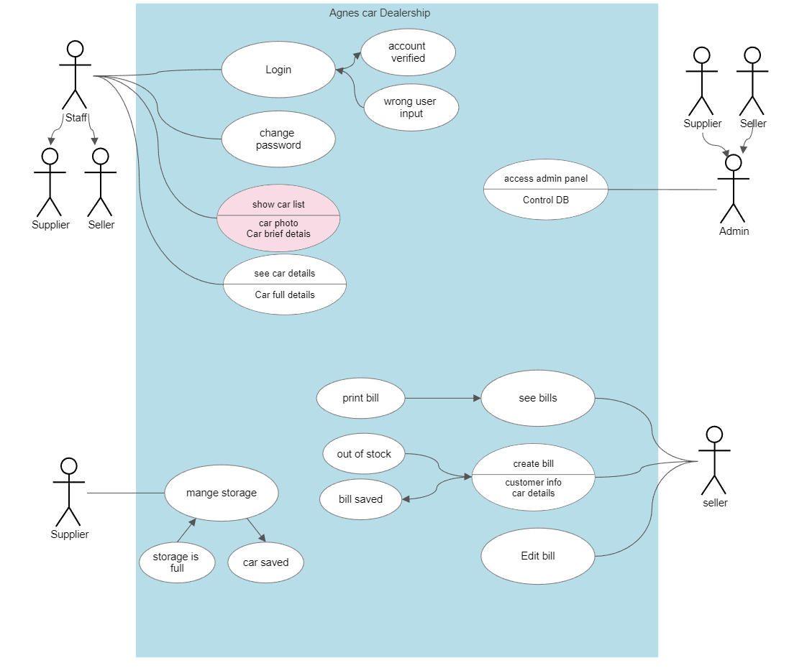

# Cars-Dealership-system

some of the analyses for the program and the DB

use case

First Actor: Admin
• Have All Access Panal.
• Control DataBase.
• Edit In Program Source Code.

Second Actor: Supplier
• Can Login.
• Can add a new cars.
• Can Delete Cars.
• Can Edit Cars.
• Can Check If Storge Full Or Not.

Third Actor: Seller
• Can Login.
• Get Information From Clint.
• Sell.

skema

activity diagram
