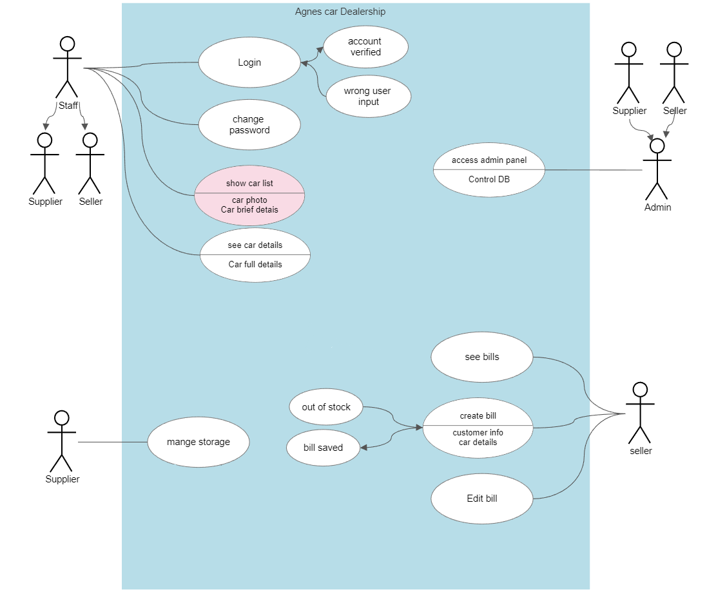
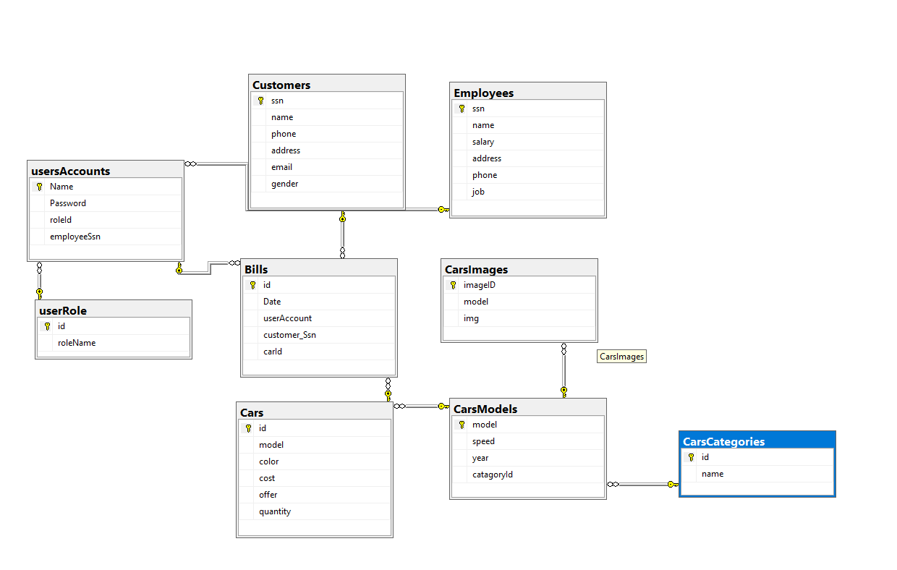
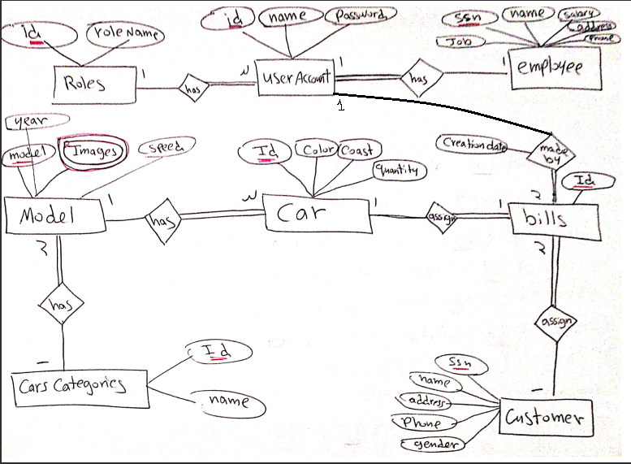

# Cars-Dealership-system
DB designed by [IslamEssamSamir](https://github.com/IslamEssamSamir)

- we used Microsoft SQL Server as local DB to add the DB to your device follow this [page](https://learn.microsoft.com/en-us/sql/relational-databases/backup-restore/quickstart-backup-restore-database?view=sql-server-ver16) to restore the DB backup file [^1].

- some of the analyses for the program and the DB

use case

DB schema

DB ER

[^1]:make sure that you changed the connection string in the program class 
