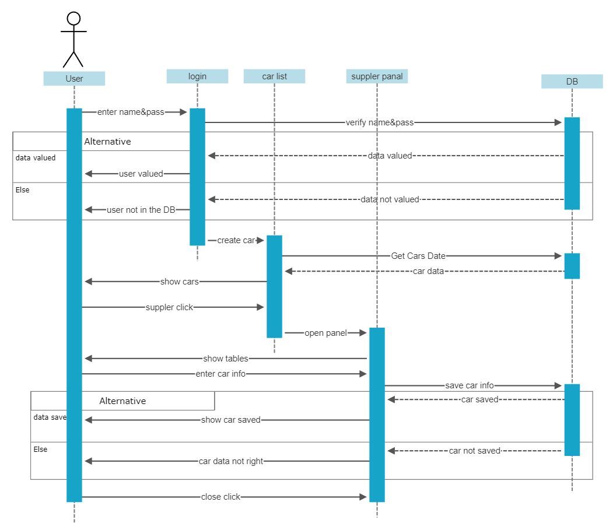

# Cars-Dealership-system

- UI:

the project is about a "car agency system" for sales and authorization access of employees  

- we used c# and .net library for the main program and Microsoft SQL Server as local DB to add the DB to your device follow this [page](https://learn.microsoft.com/en-us/sql/relational-databases/backup-restore/quickstart-backup-restore-database?view=sql-server-ver16) to restore the (DB backup.bak) file [^1].

- if you don't like the full-screen window in the program you can change it back to a resizable window and the app already flexible with this option

#### Some of the analyses for the program and the DB:

 use case

Sequence Diagram

DB schema

DB ER

[^1]:make sure that you changed the connection string in the program class 

